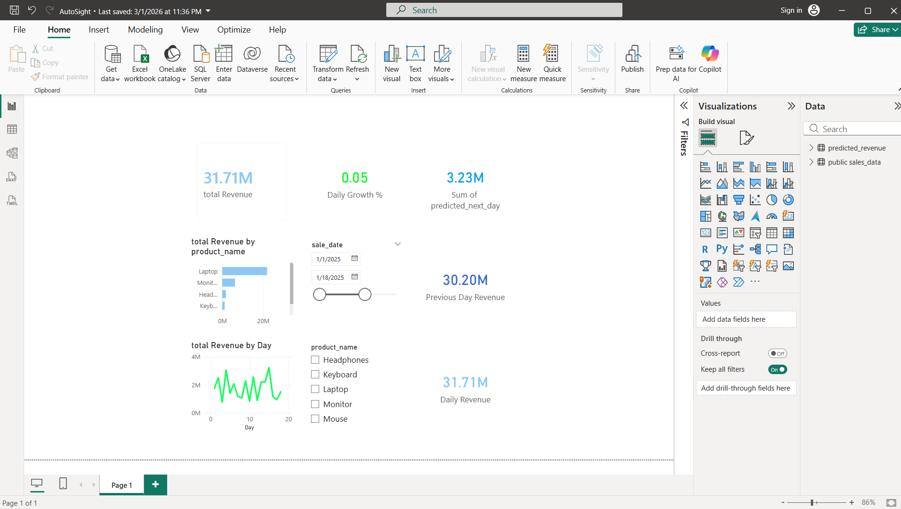
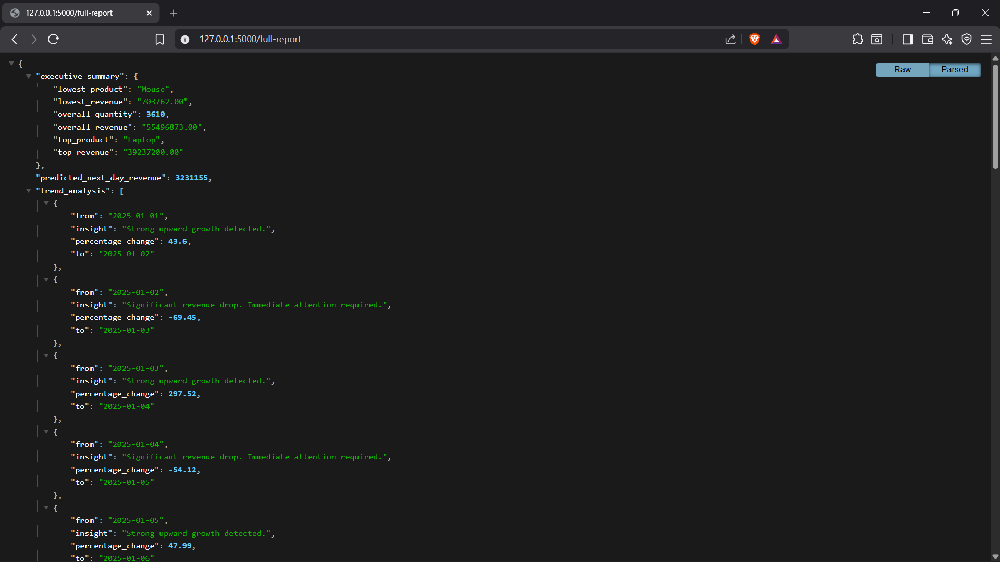
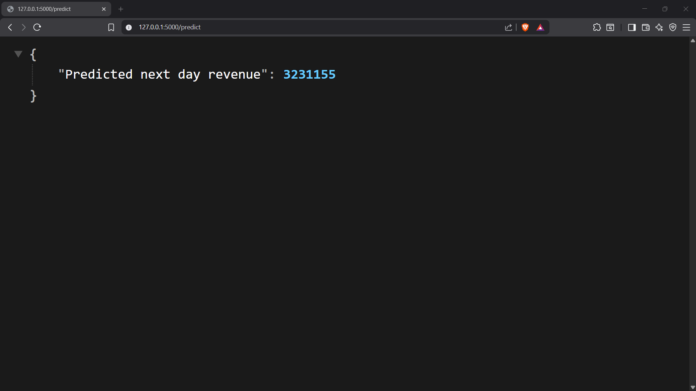
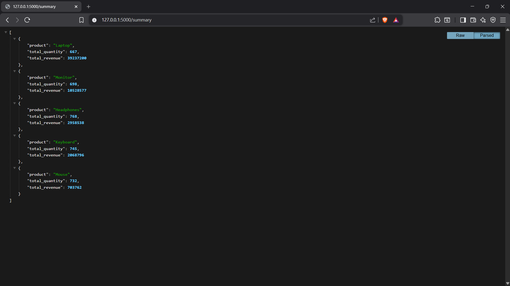

# 🚀 AutoSight – Sales Analytics Pipeline

## 📌 About The Project

AutoSight is a **modular sales analytics pipeline** designed to demonstrate how raw sales data can be transformed into actionable business insights.

The project simulates a **real-world analytics workflow** where data flows through multiple layers:

- Data ingestion
- Database storage
- Analytical processing
- Data transformation
- Visualization & reporting

AutoSight processes raw sales data, performs revenue analytics, generates trend insights, predicts future revenue, and produces structured reports for decision-making.

---

## 🏗 Project Architecture

``` bash
Raw CSV Data
│
▼
Python Ingestion Layer
│
▼
PostgreSQL Database
│
▼
Analytics Engine (Python)
│
▼
dbt Transformations
│
▼
Power BI Dashboard

```


This layered architecture reflects **industry-standard data engineering workflows**.

---

## 📂 Project Structure

``` bash
autosight_project/
│
├── main.py → Pipeline orchestrator
├── db.py → PostgreSQL connection handler
├── ingestion.py → CSV ingestion layer
├── analysis.py → Revenue analytics & prediction logic
├── visualization.py → Revenue trend charts
├── reporting.py → JSON report generation
├── logger_config.py → Logging configuration
│
├── autosight_dbt/ → dbt transformation models
│ ├── models/
│ │ ├── daily_revenue.sql
│ │ └── monthly_revenue.sql
│ └── schema.yml
│
├── dashboards/
│ └── AutoSight.pbix → Power BI dashboard
│
├── revenue.png → Revenue trend visualization
├── autosight.log → Runtime logs
├── .env → Environment variables (ignored)
└── README.md
```


Each module follows the **Single Responsibility Principle** to keep the pipeline modular and maintainable.

---

## 📊 Features Implemented

### 🔹 Data Ingestion
- Reads structured CSV sales data  
- Loads transactions into PostgreSQL  
- Validates data before insertion  

---

### 🔹 Revenue Analytics
- Calculates total revenue  
- Product-wise revenue performance  
- Daily revenue aggregation  

---

### 🔹 Trend Analysis
Daily revenue changes are categorized into:  
- **Strong Growth**  
- **Moderate Growth**  
- **Revenue Decline**  

---

### 🔹 Revenue Prediction
- Moving-average based prediction for next-day revenue  
- Handles division-by-zero and ensures stability using recent data  

---

### 🔹 Visualization
- Revenue trends plotted with Matplotlib  
- Output: `revenue.png`  
- Highlights highest and lowest revenue days  

---

### 🔹 Data Transformation with dbt
- dbt is used for **SQL-based data modeling**  
- Transforms raw transactional data into analytics-ready models  
- Includes **data quality tests** to ensure reliable metrics  

**Models Created:**

#### daily_revenue
Aggregates total revenue per day:

```sql
SELECT
    sale_date,
    SUM(total_revenue) AS daily_revenue
FROM sales_data
GROUP BY sale_date;

```
### 🔹 Power BI Dashboard

- Visual exploration of transformed tables (AutoSight.pbix)

- Shows:

- Daily revenue trends

- Key KPIs

- Business performance metrics

### 🔹 JSON Reporting

- Exports structured analytics reports (report.json)

- Contains:

- Executive summary

- Product performance

- Trend insights

- Predicted revenue

### 🔹 Logging

- Centralized logging system (autosight.log)

- Captures pipeline execution, data ingestion status, and error tracking

## 🛠 Tech Stack
``` bash
Layer                                                       Technology

Programming	                                                Python 3.13
Database	                                                PostgreSQL
Transformation	                                            dbt Core
Visualization	                                            Power BI, Matplotlib
Database                                                    Driver	psycopg2
Environment Mgmt	                                        python-dotenv
Version                                                     Control	Git & GitHub
```

## ▶️ How To Run

### 1️⃣ Clone Repository
``` bash
git clone https://github.com/kartikeyvashist/autosight.git
cd autosight
```

### 2️⃣ Create .env File

``` bash
DB_HOST=localhost
DB_NAME=autoinsight_db
DB_USER=postgres
DB_PASSWORD=your_password
DB_PORT=5432
```

## 3️⃣ Install Dependencies
``` bash
pip install -r requirements.txt
```
## 4️⃣ Run the Pipeline
``` bash
python main.py
```

## 📊 A Power BI Dashboard

report (`AutoSight.pbix`) is included for visual exploration of the sales data.

## 📸 Sample Output



## 📸 Screenshots

### Flask API

#### - Full Report



#### - Prediction 



#### - Summary



## 📚 Key Concepts Demonstrated

- Modular data pipeline design

- SQL-based data transformations

- Data modeling with dbt

- Analytics-ready dataset creation

- Data visualization and reporting

- Logging and error handling

- Version control with Git

## 🚀 Future Improvements

- Integrate modern ingestion tools (Airbyte / Fivetran)

- Use cloud-based data warehouse (Snowflake / BigQuery)

- Automate orchestration using Airflow

- Add advanced ML models for revenue forecasting

- Build REST API layer for automated report delivery

## 👨‍💻 Author

<b>Kartikey Vashisht</b> – Aspiring Data Analyst / Data Engineer building end-to-end analytics pipelines and data-driven solutions.